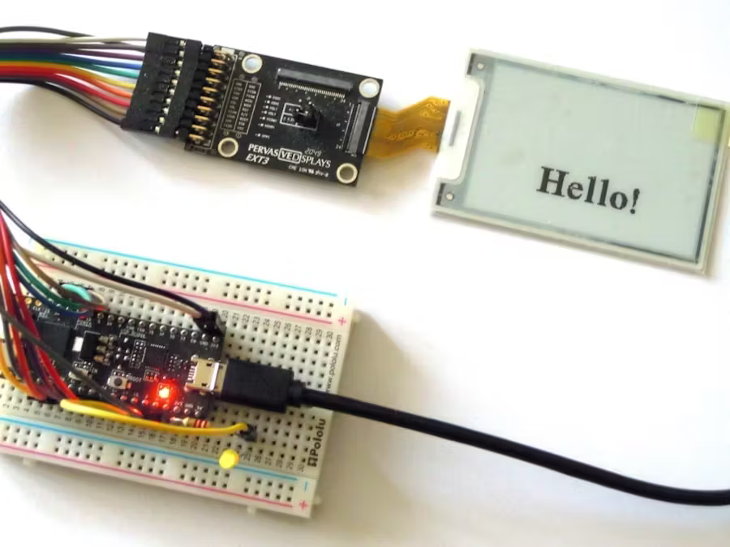

# PDI EXT3 Remote Pictures

*Display pictures remotely on an e-paper panel*

## Instructions

Find the full instructions at [Hackster.io](https://www.hackster.io/rei-vilo/remote-e-paper-pictures-panel-44094f).

The project has been updated to use [PDLS_Basic](https://github.com/rei-vilo/PDLS_Basic) and [Pervasive_Wide_Small](https://github.com/PervasiveDisplays/Pervasive_Wide_Small) release `9.0` and up.

## Licence

**Copyright** &copy; Rei Vilo, 2022-2025

*For exclusive use with Pervasive Displays screens*

**Licence** CC BY-NC-SA 4.0 

Attribution-NonCommercial-ShareAlike 4.0 International

https://creativecommons.org/licenses/by-nc-sa/4.0/

